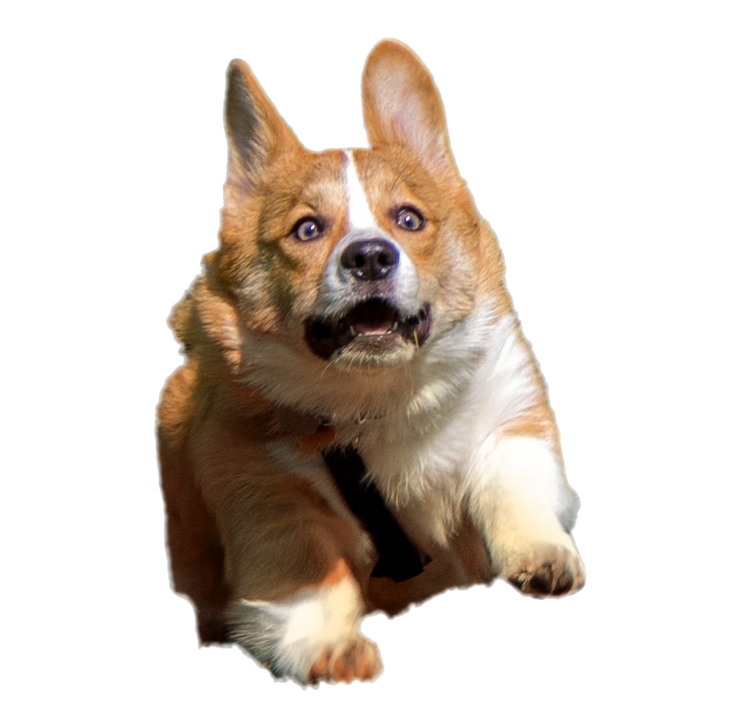

[![Contributors][contributors-shield]][contributors-url]
[![Forks][forks-shield]][forks-url]
[![Stargazers][stars-shield]][stars-url]
[![Issues][issues-shield]][issues-url]
[![LinkedIn][linkedin-shield]][linkedin-url]

<!-- PROJECT LOGO -->
 

  

  <h3 align="center">Arduino Face Tracking.</h3>
  
  

  Redone by me!
     
     
     
    <a href="https://i.imgur.com/XkbcIeS.png">View Example</a>
    ·
    <a href="https://github.com/LanaDelSlay/Arduino-Face-Tracking/issues">Report Bugs</a>
  

<!-- TABLE OF CONTENTS -->

  
Table of Contents

  <ol>
    <li>
      <a href="#about-the-project">About The Project</a>
      <ul>
      </ul>
    </li>
    <li><a href="#getting-started">Getting Started</a></li>
    <li><a href="#usage">Usage</a></li>
    <li><a href="#contributing">Contributing</a></li>
    <li><a href="#contact">Contact</a></li>
    <li><a href="#acknowledgements">Acknowledgements</a></li>
  </ol>

<!-- ABOUT THE PROJECT -->
## About The Project
    This is a modified version of popular circulating face tracking code that I found to not work, and edited it to actually work lol! 

<!-- GETTING STARTED -->
## Getting Started

Instructions coming soon.

<!-- USAGE EXAMPLES -->
## Usage
Do whatever you want with this!

<!-- CONTRIBUTING -->
## Contributing

Contributions are what make the open source community such an amazing place to be learn, inspire, and create. Any contributions you make are **greatly appreciated**.

1. Fork the Project
2. Create your Feature Branch (`git checkout -b feature/AmazingFeature`)
3. Commit your Changes (`git commit -m 'Add some AmazingFeature'`)
4. Push to the Branch (`git push origin feature/AmazingFeature`)
5. Open a Pull Request

<!-- CONTACT -->
## Contact

Graham - gmiller1902@gmail.com

Project Link: [https://github.com/LanaDelSlay/Arduino-Face-Tracking/](https://github.com/LanaDelSlay/Arduino-Face-Tracking/)

<!-- ACKNOWLEDGEMENTS -->
## Acknowledgements
* [Original Article](https://create.arduino.cc/projecthub/WolfxPac/face-tracking-using-arduino-b35b6b)

<!-- MARKDOWN LINKS & IMAGES -->
<!-- https://www.markdownguide.org/basic-syntax/#reference-style-links -->
[contributors-shield]: https://img.shields.io/github/contributors/othneildrew/Best-README-Template.svg?style=for-the-badge
[contributors-url]: https://github.com/LanaDelSlay/Arduino-Face-Tracking/graphs/contributors
[forks-shield]: https://img.shields.io/github/forks/othneildrew/Best-README-Template.svg?style=for-the-badge
[forks-url]: https://github.com/LanaDelSlay/Arduino-Face-Tracking/network/members
[stars-shield]: https://img.shields.io/github/stars/othneildrew/Best-README-Template.svg?style=for-the-badge
[stars-url]: https://github.com/LanaDelSlay/Arduino-Face-Tracking/stargazers
[issues-shield]: https://img.shields.io/github/issues/othneildrew/Best-README-Template.svg?style=for-the-badge
[issues-url]: https://github.com/LanaDelSlayArduino-Face-Tracking/issues
[linkedin-shield]: https://img.shields.io/badge/-LinkedIn-black.svg?style=for-the-badge&logo=linkedin&colorB=555
[linkedin-url]: https://www.linkedin.com/in/graham-miller-b655611aa/
[product-screenshot]: images/screenshot.png
